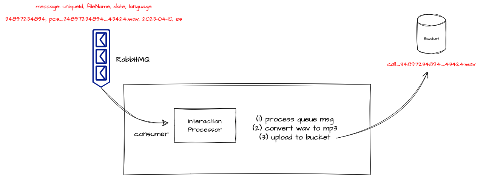

# OMniLeads: Analisis de sentimiento

#### This project is part of OMniLeads - 100% Open-Source Contact Center Software

#### [Community discord](https://discord.gg/FEDkVmSQ)


This component is responsible for processing call recordings from the telephony channel. One of its functionalities is to convert recordings in WAV format to MP3 and upload them to an S3 bucket. Additionally, when recordings from separate channels (client and agent) are activated, the component removes silence before uploading the MP3 files to the bucket. This facilitates the manipulation of these files for further analysis or transcription.

##Environment Variables

The following list of environment variables needs to be passed when running the component as part of the OMniLeads suite.

```
TZ=
RABBITMQ_HOST={{ rabbitmq_host }}
S3_BUCKET_NAME={{ bucket_name }}
S3_ENDPOINT={{ minio_host }}
AWS_ACCESS_KEY_ID={{ bucket_access_key }}
AWS_SECRET_ACCESS_KEY={{ bucket_secret_key }}
AWS_DEFAULT_REGION=us-east-1
CALLREC_DEVICE=s3
```

Requests are received through a RabbitMQ queue and are sent from an Asterisk ACD instance that has just finished generating a recording of a telephone call.




